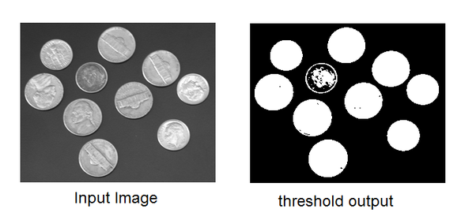
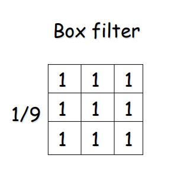

# Image Processing

Write some code that reads in a given image and processes it, and writes a new image to disk.

### Image Format
For problems like this the PPM format is the easiest to handle, you can convert an image to ppm using the convert command (on linux):
```convert -compress none image.png image.ppm```

Alternatively there are programs and even websites you can use.

Writing a PPM is fairly simple, for the full spec please refer to http://netpbm.sourceforge.net/doc/ppm.html.
You can also check out [an example from this repo](https://github.com/pier-robot/euled-up/blob/main/Week_2_Lines_w_Bresenham/brd/Main/Program.cs#L29), which writes a plain PPM.

## Processing Techniques
### Thresholding
Segment the image by applying a value to each pixel based on a threshold. In the most simple case (Binary Thresholding) if a pixels intensity is higher than the threshold it will be set to a max value, if it is lower then it will be set to 0. Please refer this image I stole from the internet:


*Wow look at those simplified coins! Mayhaps these are easier to count?! - a computer*

N.B. This task is easier with greyscale images.

**Extra:** Do some additional processing to automatically calculate and set the threshold for any given image.

### Blurring
Blurring the image! The simplest way to do this is with a box filter using kernel convolution. In more normal terms, you change a pixel's colour based on the weighted values of its 8 neighbours (unless it is an edge pixel). The 'kernel' in this case refers to a matrix that represents the weights assigned to each pixel:



Given a kernel multiply each pixel by its weight, add them together and divide to get an average, which is then assigned to the middle pixel. With a box filter all the pixels are equally weighted. It blurs the image nicely!

Changing the weights around can cause different kinds of blurring, or be used for edge detection: [case examples and their weights](https://en.wikipedia.org/wiki/Kernel_(image_processing)).

**Extra:** Try some of the example weights from the wiki link and see the results.

(More in-depth smoothing explanation can be found [here](http://www.cse.psu.edu/~rtc12/CSE486/lecture04.pdf))

### Additional

OpenCV has a lot of information on image processing [here](https://docs.opencv.org/master/d7/da8/tutorial_table_of_content_imgproc.html) you can take a stab at implementing anything on this page (we think Eroding and Dilating would be a good option!)